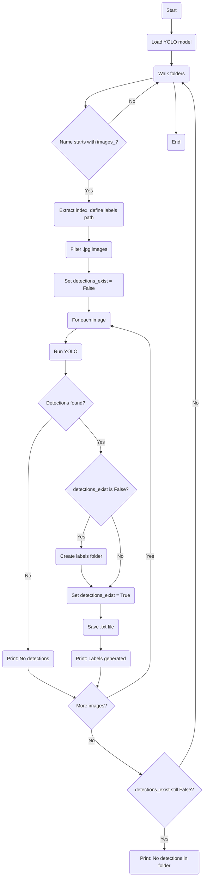

``` mermaid
flowchart TD
  A(Start) --> B(Load YOLO model)
  B --> C(Walk folders)
  C --> D{Name starts with images_?}
  D -- No --> C
  D -- Yes --> E(Extract index, define labels path)
  E --> F(Filter .jpg images)
  F --> G(Set detections_exist = False)
  G --> H(For each image)
  H --> I(Run YOLO)
  I --> J{Detections found?}
  J -- No --> K(Print: No detections)
  K --> L{More images?}
  J -- Yes --> M{detections_exist is False?}
  M -- Yes --> N(Create labels folder)
  N --> O(Set detections_exist = True)
  M -- No --> O
  O --> P(Save .txt file)
  P --> Q(Print: Labels generated)
  Q --> L
  L -- Yes --> H
  L -- No --> R{detections_exist still False?}
  R -- Yes --> S(Print: No detections in folder)
  R -- No --> C
  C --> T(End)
```